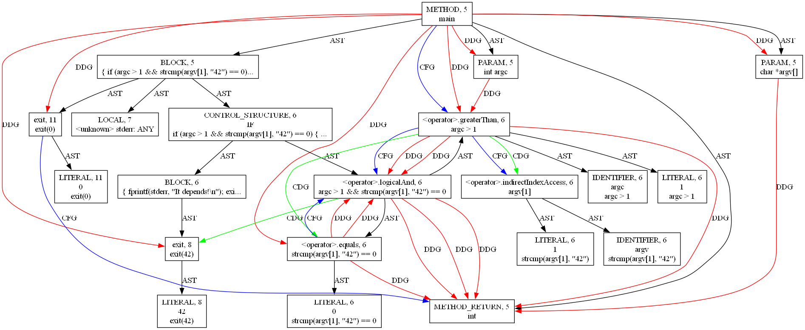

# 🛡️ PROVEN-GNN

## PROgram Vulnerability Examination Network using Graph Neural Networks

[](https://opensource.org/licenses/MIT)
[](https://www.python.org/downloads/)
[](https://abdksm.github.io/PROVEN-GNN/docs/leaderboard.html)

**[🏆 View Live Leaderboard](https://abdksm.github.io/PROVEN-GNN/docs/leaderboard.html)**

---

## 🎯 Challenge Overview

Welcome to **PROVEN-GNN** (**PRO**gram **V**ulnerability **E**xamination **N**etwork using **G**raph **N**eural **N**etworks), a competition designed to compare human-built Graph Neural Network (GNN) solutions against Large Language Model (LLM)-based approaches.

The objective is to classify code functions as **vulnerable** or **non-vulnerable** using graph representations of source code.

---

## 🏆 Competition Details

| **Aspect**            | **Details**                                                          |
| --------------------- | -------------------------------------------------------------------- |
| **Task Type**         | Binary Graph Classification                                          |
| **Evaluation Metric** | **Macro F1-Score**                                                   |
| **Dataset**           | Inspired by [DiverseVul](https://github.com/wagner-group/diversevul) |

---

## 📊 Dataset Description

### Source

* **Original Dataset**: [DiverseVul Dataset](https://github.com/wagner-group/diversevul)
* **Citation**:
  Chen, Yizheng, et al. *"DiverseVul: A New Vulnerable Source Code Dataset for Deep Learning-Based Vulnerability Detection."*
  Proceedings of the 26th International Symposium on Research in Attacks, Intrusions and Defenses (RAID), 2023.

---

### Graph Construction

The dataset was adapted by generating graph representations for a subset of code functions. It includes **2,487 training graphs** and **622 test graphs**. The class distribution is imbalanced, with vulnerable code representing only **29%** of the data.


We used **Joern** to construct **Code Property Graphs (CPG)**, which combine:

* Abstract Syntax Tree (AST)
* Control Flow Graph (CFG)
* Program Dependence Graph (PDG)
* Control Dependence Graph (CDG)
* Data Dependence Graph (DDG)

The following figure shows an example of a generated CPG:



---

### Node Features (527 Dimensions)

* **Node Type (15 features)**
  Encodes the type of node (e.g., method, function call, variable declaration, etc.)

* **Code Embedding (512 features)**
  Dense embedding representing the code snippet associated with the node.

---

### Edge Features (12 Types)

Edge features represent the type of relationship between nodes (e.g., AST, CFG, PDG, CDG, DDG).

---

## 📁 Repository Structure

```
PROVEN-GNN
├── data/
│   ├── public/
│   │   ├── train_data.csv    (to be downloaded)
│   │   ├── test_data.csv     (to be downloaded)
│   │   ├── test_ids.csv
│   │   ├── sample_submission.csv
│   │   └── README.md
├── competition/
│   ├── config.yaml
│   ├── update_leaderboard.py
│   ├── evaluate.py
│   ├── render_leaderboard.py
│   └── validate_submission.py
├── submissions/             (place submission files here)
│   └── README.md
├── leaderboard/
│   ├── leaderboard.csv
│   └── leaderboard.md
├── docs/
│   ├── leaderboard.html
│   ├── leaderboard.css
│   └── leaderboard.js
└── .github/workflows/
    ├── score_submission.yml
    └── publish_leaderboard.yml
```

---

## 🚀 Getting Started

### 1️⃣ Clone the Repository

```bash
git clone https://github.com/abdksm/PROVEN-GNN.git
cd PROVEN-GNN
```

### 2️⃣ Install Dependencies

```bash
pip install -r starter_code/requirements.txt
```

### 3️⃣ Download the Data

```bash
cd data/public
pip install gdown

gdown --id 1kUNwo7WjVpJ2D1GPsotiNO5FJnCqt--9 -O train_data.parquet
gdown --id 1xhg62LTAJm5ityBKiXKv8Rsg0eSl9TJC -O test_data.parquet
```

### 4️⃣ Run the Baseline Model

```bash
cd ../../starter_code
python baseline.py
```

---

## 📤 Making a Submission

### Submission Format

#### `predictions.csv`

```csv
id,y_pred
0,1
1,0
2,1
...
```

#### `metadata.json`

```json
{
  "team": "example_team",
  "run_id": "example_run_id",
  "type": "human", 
  "model": "GAT",
  "notes": "Additional notes"
}
```

`type` must be one of:

* `"human"`
* `"llm-only"`
* `"human+llm"`

---

### Submission Steps

1. Fork this repository
2. Train your model and generate predictions
3. Add `predictions.csv` and `metadata.json` to the `submissions/` directory
4. Create a Pull Request
5. GitHub Actions automatically evaluate your submission
6. Results are posted as a comment and added to the leaderboard

---

## 📈 Evaluation Metric

The evaluation metric is **Macro F1-Score**:

$$
\text{Macro F1} = \frac{F1_{Vulnerable} + F1_{Non\text{-}Vulnerable}}{2}
$$

Rankings are sorted by **descending score**.

---

## 🏆 Leaderboard

After submission, scores are automatically added to:

* `leaderboard/leaderboard.csv`
* `leaderboard/leaderboard.md`

An interactive leaderboard is available here:

👉 [Live Leaderboard](https://abdksm.github.io/PROVEN-GNN/docs/leaderboard.html)

---

## 🎯 Challenge Rules

* ❌ No external or private datasets
* ❌ No manual labeling of test data
* ❌ No modification of evaluation scripts
* ✅ Unlimited offline training is allowed
* ⚠️ Only one submission per user is allowed

Violations may result in disqualification.

---

## 📝 Citation

```bibtex
@misc{proven_gnn_2025,
  title={PROVEN-GNN: Program Vulnerability Examination Network},
  author={Abderrahmane Kasmi},
  year={2025},
  url={https://github.com/abdksm/PROVEN-GNN}
}
```

---

## 📜 License

This project is licensed under the MIT License.
See the [LICENSE](LICENSE) file for details.
